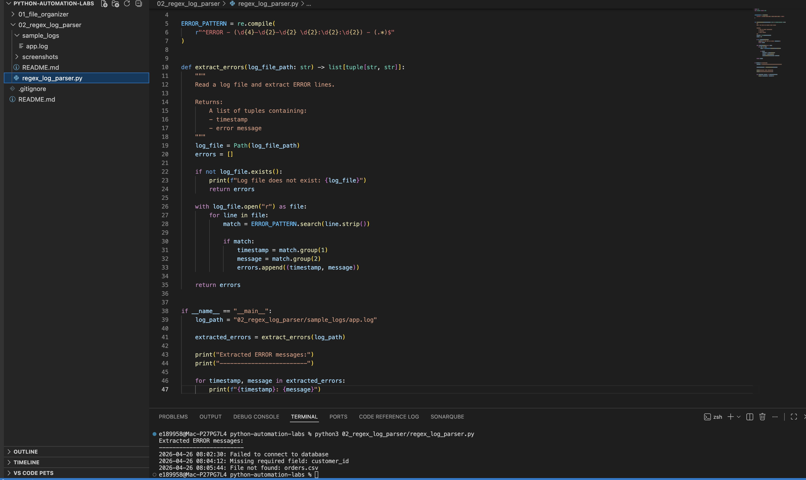

# Regex Log Parser

## Overview

This mini-project demonstrates how Python regular expressions can be used to extract structured information from unstructured text.

The script reads a sample application log file, identifies lines that begin with `ERROR`, and extracts two useful pieces of information:

- Timestamp
- Error message

## Why This Matters

Log files are common in data engineering, application support, ETL jobs, cloud workflows, and pipeline monitoring.

Manually searching logs is slow and error-prone. Regex allows us to automate pattern matching so important information can be extracted quickly and consistently.

## What This Project Covers

This project practices the same regex concepts from the Python Automation module:

- `re` module
- `re.compile()`
- Regex objects
- Capture groups with parentheses
- `search()`
- Start/end anchors
- Character classes
- Quantifiers
- Extracting structured values from text

## Regex Pattern Used

Pattern:

`^ERROR - (\d{4}-\d{2}-\d{2} \d{2}:\d{2}:\d{2}) - (.*)$`

## Pattern Breakdown

| Pattern Part | Meaning |
|---|---|
| `^` | Start of the line |
| `ERROR - ` | Match only lines beginning with ERROR |
| `(\d{4}-\d{2}-\d{2} \d{2}:\d{2}:\d{2})` | Capture the timestamp |
| `.*` | Capture the rest of the line as the error message |
| `$` | End of the line |

## Example Log Input

`ERROR - 2026-04-26 08:02:30 - Failed to connect to database`

## Extracted Output

Timestamp:

`2026-04-26 08:02:30`

Message:

`Failed to connect to database`

## How It Works

1. Open the log file
2. Read each line
3. Use regex to search for ERROR lines
4. Capture the timestamp and message
5. Store the results in a list of tuples
6. Print the extracted errors

## How to Run

From the root of the repository:

`python3 02_regex_log_parser/regex_log_parser.py`

## Example Result

```text
Extracted ERROR messages:
-------------------------
2026-04-26 08:02:30: Failed to connect to database
2026-04-26 08:04:12: Missing required field: customer_id
2026-04-26 08:05:44: File not found: orders.csv
```

### Screenshot



## Key Takeaway

Regex is useful when text has a predictable pattern but is not already structured as rows and columns.

In data engineering, this can be used for:
- Parsing logs
- Extracting IDs
- Validating file names
- Checking timestamps
- Identifying failed pipeline events