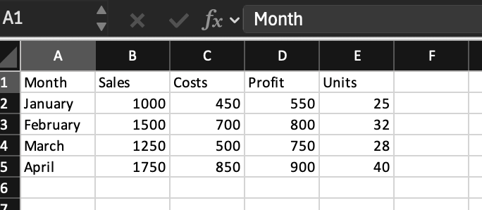
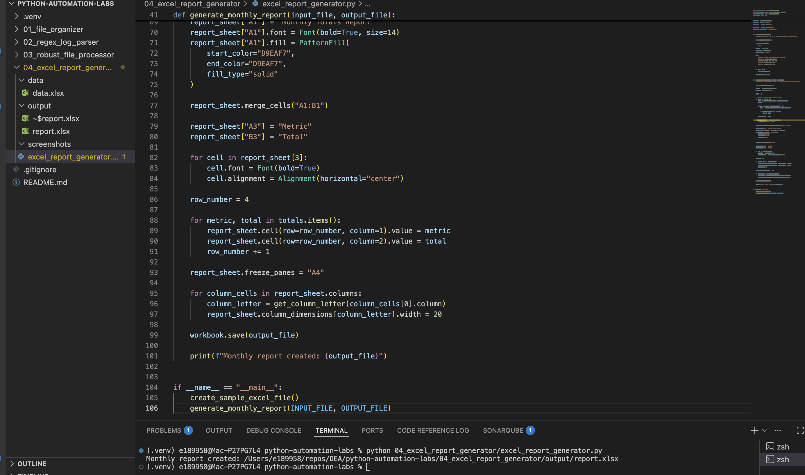
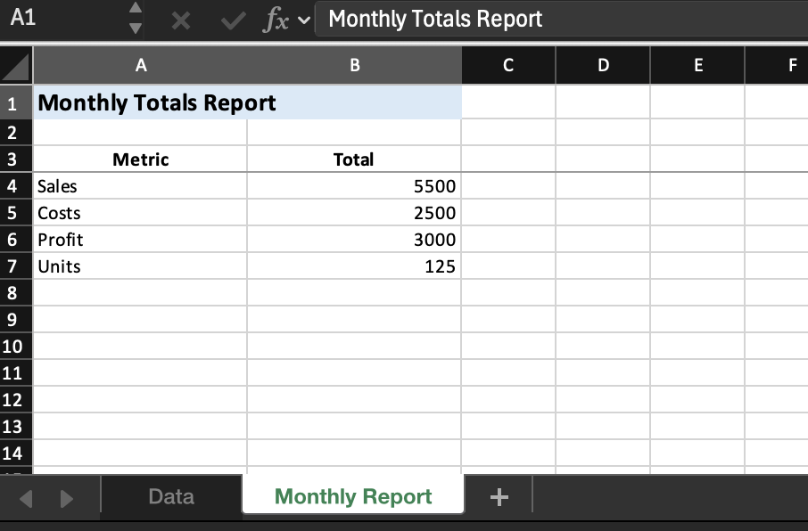

# Excel Monthly Report Generator

## Overview

This mini-project demonstrates how Python can automate Excel-based reporting using the `openpyxl` library.

The script reads raw data from an Excel file, calculates column totals, and generates a formatted report in a new worksheet.

---

## Why This Matters

Excel is widely used in business and data workflows, but manual updates are time-consuming and error-prone.

In data engineering and analytics workflows, automating Excel tasks helps:

- Reduce manual effort  
- Improve accuracy  
- Ensure consistency in reporting  
- Scale repetitive tasks  

---

## What This Project Covers

- `openpyxl` library  
- Reading Excel files  
- Looping through rows and columns  
- Writing data to new sheets  
- Basic formatting (bold text, headers)  
- Automating report generation  

---

## Input Data

---

## How It Works

1. Load an Excel workbook  
2. Read data from the input sheet  
3. Loop through columns and calculate totals  
4. Create a new worksheet for the report  
5. Write totals into the report  
6. Apply simple formatting  
7. Save the updated workbook  

---

## How to Run

From the root of the repository:

`python3 04_excel_report_generator/excel_report_generator.py`

---

## Example Script Execution

---

## Generated Report Output

---

## Code Example

---

## Key Takeaway

Python can automate Excel workflows that would otherwise be done manually.

Using `openpyxl`, we can:

- Read structured data  
- Perform calculations  
- Generate reports  
- Apply formatting  

This significantly improves efficiency for repetitive reporting tasks.

---

## Real-World Data Engineering Connection

This project simulates automated reporting in a data pipeline.

In real-world scenarios, similar workflows are used when:

- Generating business reports from processed data  
- Exporting pipeline results to Excel  
- Delivering reports to stakeholders  
- Automating recurring reporting tasks  

This bridges the gap between raw data processing and business-facing outputs.