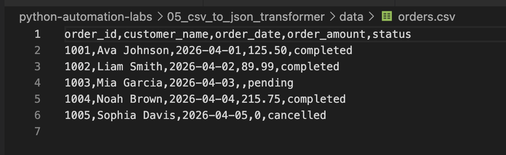
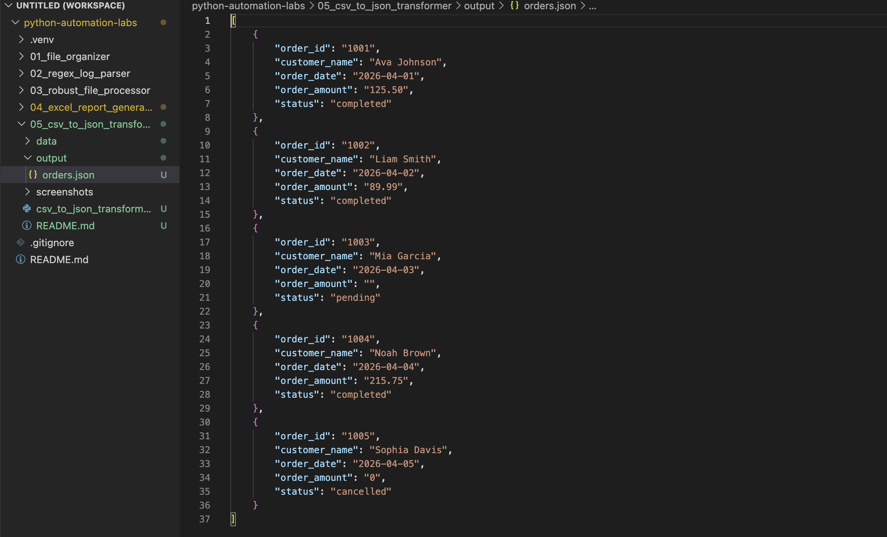
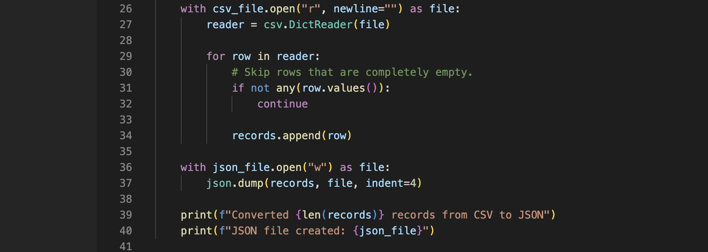

# CSV to JSON Transformer

## Overview

This mini-project demonstrates how Python can convert structured CSV data into JSON format.

The script reads an orders CSV file, converts each row into a dictionary, stores all rows in a list, and writes the result to a formatted JSON file.

## Why This Matters

CSV and JSON are two common data formats used in data engineering, analytics, APIs, and automation workflows.

CSV files are common for spreadsheets, exports, and tabular data. JSON is common for APIs, web applications, configuration files, and semi-structured data.

Converting between formats is a common data engineering task because different systems expect data in different shapes.

## What This Project Covers

This project practices the same JSON concepts from the Python Automation module:

- `csv` module
- `json` module
- `csv.DictReader()`
- `json.dump()`
- Reading files
- Writing files
- Converting rows into dictionaries
- Creating formatted JSON output

## Input CSV Data

## How It Works

1. Open the input CSV file
2. Use `csv.DictReader()` to read each row as a dictionary
3. Store each row dictionary in a list
4. Skip completely empty rows
5. Write the list of dictionaries to a JSON file
6. Use `indent=4` to make the JSON easier to read

## How to Run

From the root of the repository:

`python3 05_csv_to_json_transformer/csv_to_json_transformer.py`

## Example Script Execution

## Example JSON Output

## Code Example

## Key Syntax

### Read CSV Rows as Dictionaries

`reader = csv.DictReader(file)`

Each row becomes a dictionary where the CSV headers become the keys.

### Write JSON Output

`json.dump(records, file, indent=4)`

This writes Python data into a JSON file. The `indent=4` argument makes the output easier to read.

## Key Takeaway

JSON is useful for storing and sharing semi-structured data.

In this project:

- CSV rows are converted into dictionaries
- Dictionaries are stored inside a list
- The list is saved as a JSON file
- The output becomes easier for APIs or applications to consume

## Real-World Data Engineering Connection

This project simulates a basic data transformation step in a pipeline.

In real-world data engineering, similar logic may be used when:

- Converting CSV exports into JSON for APIs
- Preparing data for NoSQL databases
- Transforming flat files for downstream systems
- Moving data between tools with different format requirements
- Creating structured files for cloud storage or application ingestion

This is a small but important example of data format transformation.
