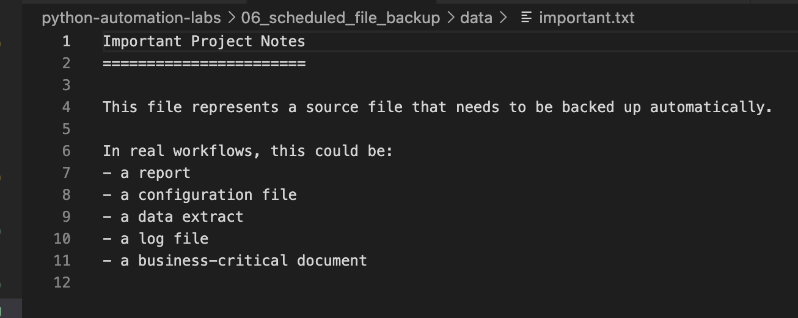
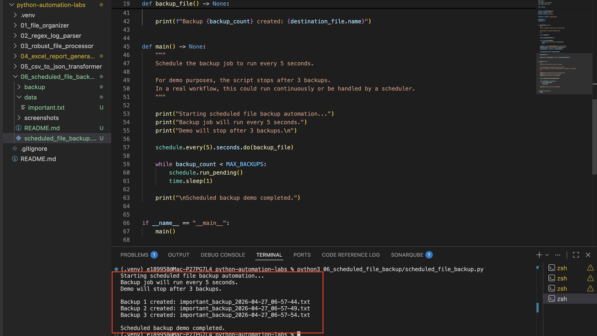
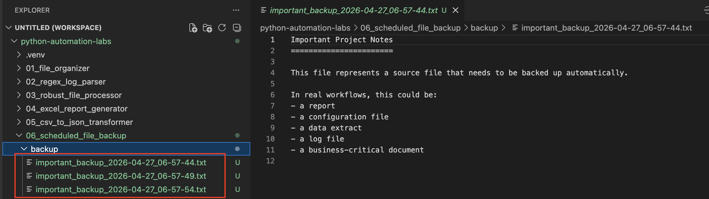
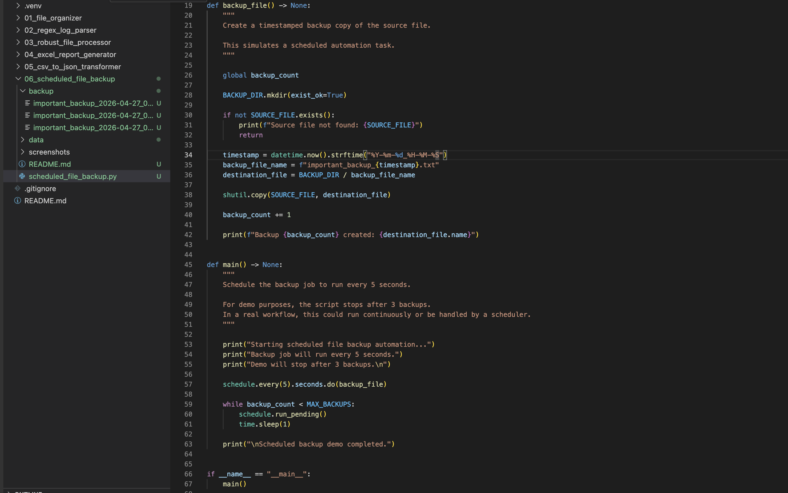

# Scheduled File Backup

## Overview

This mini-project demonstrates how Python can automate recurring tasks using the `schedule` library.

The script creates timestamped backup copies of an important file every few seconds. For demo purposes, the script stops after three successful backups instead of running forever.

---

## Why This Matters

Scheduling is a common automation pattern in data engineering and business workflows.

Many tasks need to run repeatedly, such as:

- Creating backups
- Generating reports
- Checking for new files
- Running data quality checks
- Triggering recurring pipeline steps

This project demonstrates the foundation of recurring job automation.

---

## What This Project Covers

- `schedule` library  
- `time.sleep()`  
- `datetime.now()`  
- `shutil.copy()`  
- File backup automation  
- Timestamped file naming  
- Recurring job scheduling  
- Controlled demo execution  

---

## Source File



---

## How It Works

1. Define the source file to back up  
2. Define the backup folder  
3. Schedule the backup job to run every 5 seconds  
4. Generate a readable timestamped filename  
5. Copy the source file into the backup folder  
6. Print progress messages to the terminal  
7. Stop automatically after three backups for demo purposes  

---

## Why Timestamped Filenames Matter

Timestamped filenames prevent overwriting previous backups and preserve backup history.

Example:

```text
important_backup_2026-04-27_06-45-58.txt
important_backup_2026-04-27_06-46-03.txt
important_backup_2026-04-27_06-46-08.txt
```

This makes backups easier to organize, review, and restore.

---

## How to Run

From the root of the repository:

`python3 06_scheduled_file_backup/scheduled_file_backup.py`

---

## Example Script Execution



---

## Backup Folder Output



---

## Code Example



---

## Key Syntax

### Schedule a Job

`schedule.every(5).seconds.do(backup_file)`

Runs the `backup_file()` function every 5 seconds.

---

### Run Pending Jobs

`schedule.run_pending()`

Checks whether any scheduled jobs are ready to run.

---

### Pause Between Checks

`time.sleep(1)`

Prevents the loop from consuming unnecessary CPU resources.

---

### Create a Timestamp

`datetime.now().strftime("%Y-%m-%d_%H-%M-%S")`

Creates a readable timestamp used in backup filenames.

---

### Copy a File

`shutil.copy(SOURCE_FILE, destination_file)`

Copies the source file into the backup folder.

---

## Key Takeaway

Scheduling allows Python scripts to automate recurring tasks without manual intervention.

In this project:

- A backup task runs automatically  
- Each backup receives a unique filename  
- Previous backups are preserved  
- The script demonstrates scheduled automation in a simple, testable format  

---

## Real-World Data Engineering Connection

This project simulates a scheduled operational job.

In real-world data engineering, similar patterns are used when:

- Running scheduled ETL jobs  
- Backing up important files  
- Checking landing folders for new data  
- Triggering recurring workflows  
- Generating recurring reports  
- Running automated data quality checks  

This project connects Python automation to the broader idea of orchestration and recurring pipeline operations.