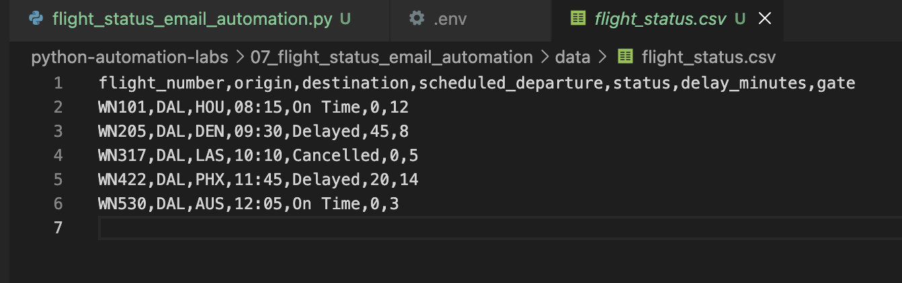
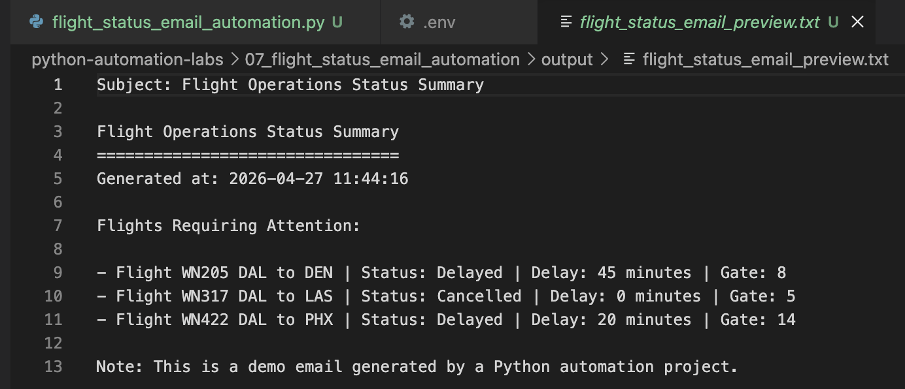
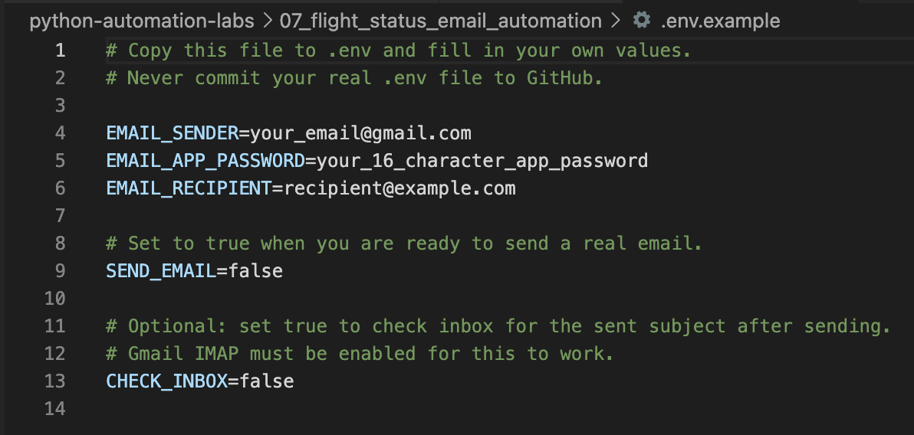
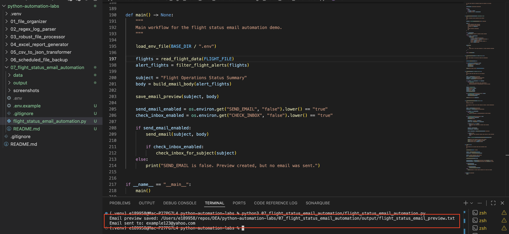
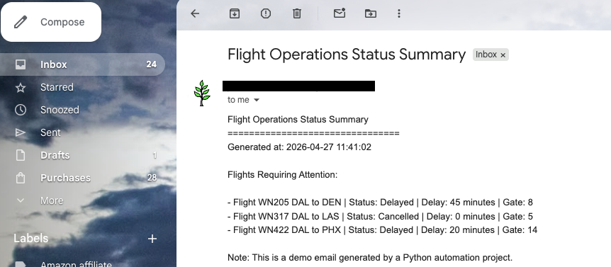
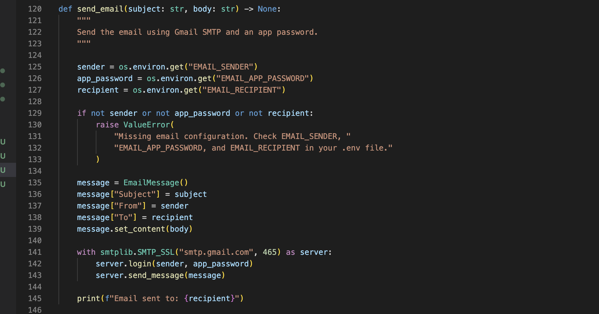

# Flight Status Email Automation

## Overview

This mini-project demonstrates how Python can generate and send an automated email report using flight operations data.

The script reads a sample CSV file of flight statuses, identifies delayed and cancelled flights, builds a professional email summary, saves a local preview, and can optionally send the email through Gmail using an App Password.

This project modernizes the bootcamp email automation topic by using a realistic airline operations scenario instead of a generic test email.

## Why This Matters

Email automation is common in business, data engineering, and operations workflows.

Automated emails are often used for:

- Daily reports
- Pipeline failure alerts
- File arrival notifications
- Operational status summaries
- Data quality alerts
- Stakeholder updates

In data engineering, email alerts are especially useful when a job needs to notify a team that something succeeded, failed, or needs attention.

## What This Project Covers

- `smtplib`
- `imaplib`
- `email.message.EmailMessage`
- Reading CSV data
- Building an email body dynamically
- Sending email with SMTP
- Optional inbox retrieval with IMAP
- Gmail App Password usage
- Local `.env` configuration
- Basic security practices for credentials

## Input Flight Data



## How It Works

1. Read flight status data from `flight_status.csv`
2. Filter for delayed and cancelled flights
3. Build a plain-text email summary
4. Save a local email preview
5. Optionally send the email through Gmail SMTP
6. Optionally check the inbox for the sent subject using IMAP

## Email Preview



## Gmail App Password Setup

This project uses a Gmail App Password instead of a normal Gmail password.

Google requires 2-Step Verification before an App Password can be created. App Passwords are intended for apps or devices that do not support “Sign in with Google.”

Important notes:

- Do not use your normal Gmail password in code
- Do not commit your App Password to GitHub
- Store the App Password only in your local `.env` file
- Revoke the App Password if it is no longer needed
- If your Google password changes, Google may revoke existing App Passwords
- Some Google accounts may not show App Passwords, such as work/school accounts, accounts using security keys only, or accounts enrolled in Advanced Protection

## Local Environment Setup

Create a local `.env` file by copying `.env.example`.

Example:

```text
EMAIL_SENDER=your_email@gmail.com
EMAIL_APP_PASSWORD=your_16_character_app_password
EMAIL_RECIPIENT=recipient@example.com
SEND_EMAIL=false
CHECK_INBOX=false
```

Set `SEND_EMAIL=true` when ready to send a real email.

Set `CHECK_INBOX=true` if you want the script to check the inbox for the sent email after sending.

Never upload your real `.env` file to GitHub.

## Safe Config Example



## How to Run

From the root of the repository:

`python3 07_flight_status_email_automation/flight_status_email_automation.py`

First run with:

`SEND_EMAIL=false`

This creates the email preview without sending a real email.

When ready, update `.env`:

`SEND_EMAIL=true`

Then run the script again.

## Example Script Execution



## Email Received



## Code Example



## Key Syntax

### Create an Email Message

`message = EmailMessage()`

Creates a modern email message object.

### Set Email Fields

`message["Subject"] = subject`

`message["From"] = sender`

`message["To"] = recipient`

### Set Email Body

`message.set_content(body)`

Adds plain-text email content.

### Send Email with Gmail SMTP

`with smtplib.SMTP_SSL("smtp.gmail.com", 465) as server:`

Connects securely to Gmail SMTP.

### Login with App Password

`server.login(sender, app_password)`

Authenticates using the Gmail address and App Password.

### Send Message

`server.send_message(message)`

Sends the email.

### Optional Inbox Retrieval

`imaplib.IMAP4_SSL("imap.gmail.com")`

Connects securely to Gmail IMAP for inbox retrieval.

## Security Considerations

This project intentionally separates secrets from code.

The `.env` file stores sensitive values locally, while `.env.example` shows the required configuration without exposing real credentials.

Security practices demonstrated:

- Credentials are not hardcoded in Python
- Real `.env` file is ignored by Git
- App Password is used instead of normal Gmail password
- Email sending is controlled with `SEND_EMAIL`
- Inbox retrieval is optional with `CHECK_INBOX`
- Screenshots should hide or crop personal email addresses when possible

## Key Takeaway

Email automation is useful for sending status updates, alerts, and reports without manual effort.

In this project:

- Flight data is read from a CSV file
- Delayed and cancelled flights are identified
- A professional email summary is generated
- The email can be sent through Gmail securely using an App Password
- The workflow models how automated operational notifications work

## Real-World Data Engineering Connection

This project simulates a notification step in a data pipeline or operations workflow.

In real-world data engineering, similar logic may be used when:

- A pipeline fails and sends an alert
- A report is generated and emailed to stakeholders
- A landing folder receives new data
- Data quality checks identify issues
- Daily operational summaries are distributed automatically

This project connects Python automation to alerting, monitoring, and stakeholder communication workflows.
