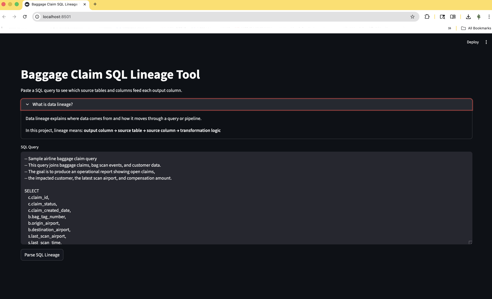
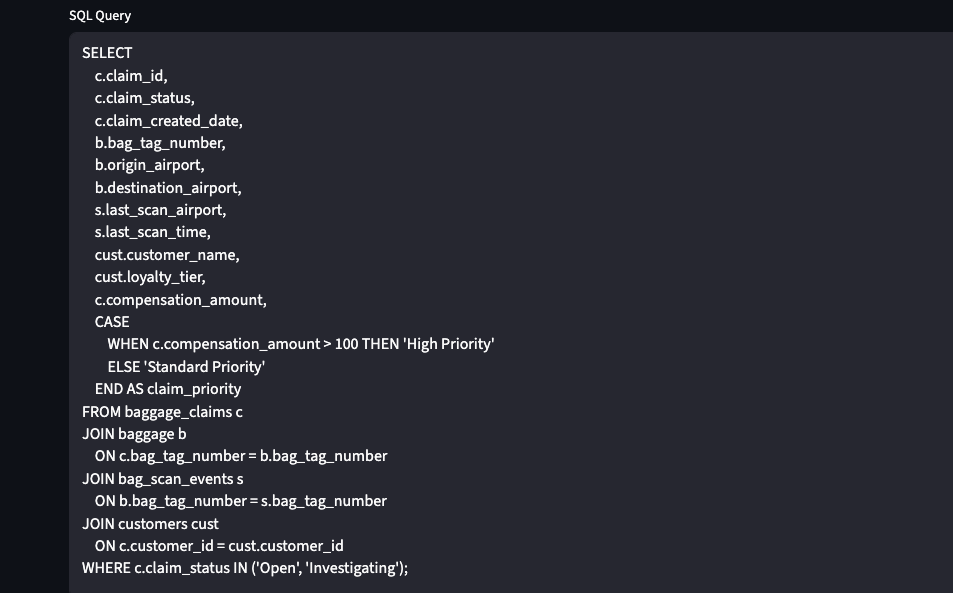
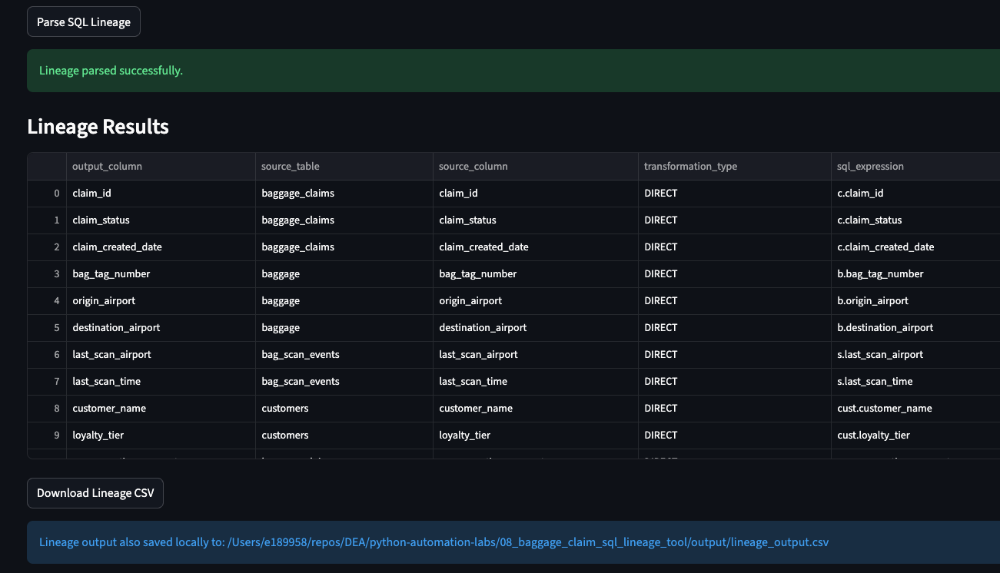
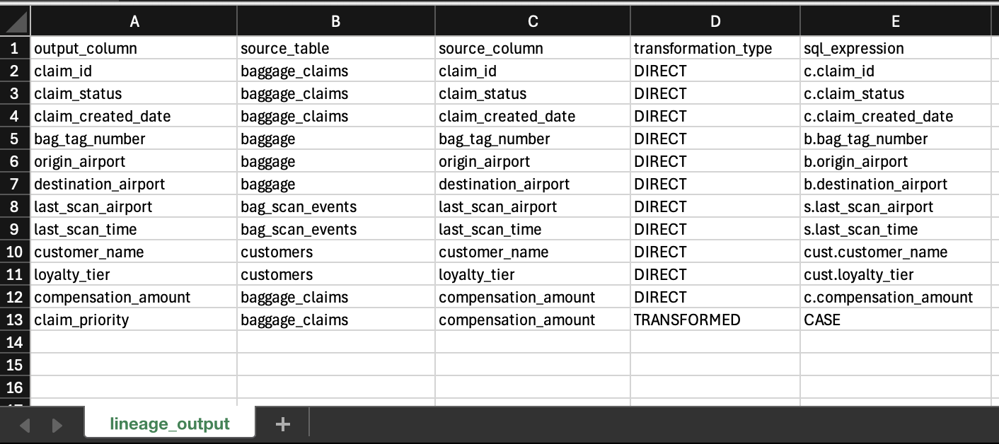
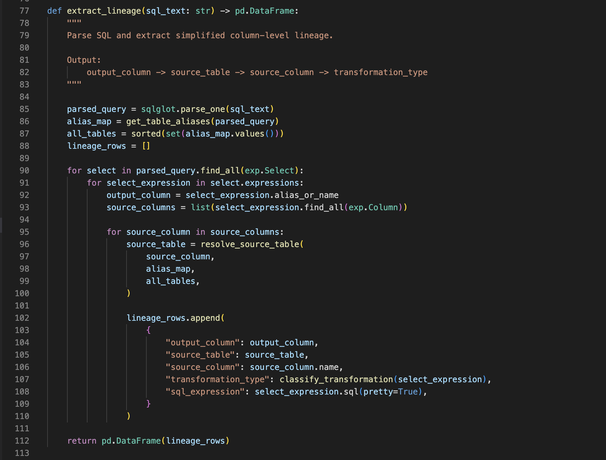

# Baggage Claim SQL Lineage Tool

## Overview

This project demonstrates a simple SQL lineage parser built with Python, Streamlit, SQLGlot, and pandas.

The app uses an airline baggage-claims scenario. A user can paste a SQL query into a local web app and see which source tables and columns feed each output column.

This project is more advanced than the earlier automation labs because it combines:

- SQL parsing
- Metadata extraction
- Data lineage concepts
- A simple GUI
- Airline-domain business logic

---

## Why This Matters

Data lineage answers an important question:

Where did this data come from?

In real data engineering work, lineage is useful for:

- Debugging broken reports
- Understanding SQL transformations
- Tracing source tables
- Supporting data governance
- Explaining business metrics
- Evaluating downstream impact when a table or column changes

For example, if a baggage-claims report shows a compensation amount, a data team may need to know which source table and source column produced that value.

---

## Airline Scenario

This project uses a baggage-claims operations example.

The sample SQL joins four tables:

- `baggage_claims`
- `baggage`
- `bag_scan_events`
- `customers`

The query creates an operational view of baggage claims, including:

- Claim status
- Bag tag number
- Origin and destination airport
- Last scan airport
- Customer name
- Loyalty tier
- Compensation amount
- Claim priority

---

## What This Project Covers

- `streamlit`
- `sqlglot`
- `pandas`
- SQL parsing
- SQL aliases
- SQL joins
- Column-level lineage
- Source-to-output mapping
- Metadata extraction
- CSV export

---

## App Preview

---

## Sample SQL Query

---

## How the Sample SQL Works

The sample query uses table aliases to make SQL shorter.

Example:

`baggage_claims c`

This means:

- Real table name: `baggage_claims`
- Alias: `c`

So this column:

`c.claim_id`

means:

`baggage_claims.claim_id`

The query also uses joins.

Example:

`JOIN baggage b ON c.bag_tag_number = b.bag_tag_number`

This connects claim records to baggage records using the shared `bag_tag_number` field.

The query includes a transformation:

`CASE WHEN c.compensation_amount > 100 THEN 'High Priority' ELSE 'Standard Priority' END AS claim_priority`

This creates a new output column called `claim_priority` based on the compensation amount.

---

## Lineage Results

---

## Exported CSV Output

---

## Code Example

---

## How It Works

1. Load the sample SQL query
2. Parse the SQL using SQLGlot
3. Find source tables and aliases
4. Find selected output columns
5. Find source columns referenced by each output column
6. Resolve aliases back to real table names
7. Classify each output as direct or transformed
8. Display lineage results in a Streamlit table
9. Save lineage results to a CSV file

---

## Key Concepts

### Data Lineage

Data lineage tracks where data comes from and how it changes as it moves through systems.

In this project, lineage is shown as:

`Output Column → Source Table → Source Column → Transformation`

---

### SQL Parsing

SQL parsing means converting SQL text into a structure that Python can inspect.

This project uses SQLGlot to parse SQL.

---

### Abstract Syntax Tree (AST)

An AST is a structured representation of code.

Instead of treating SQL as plain text, SQLGlot turns it into objects like:

- Select
- Table
- Column
- Join
- Case expression

This makes it easier to analyze query logic.

---

### Table Alias

A table alias is a short name for a table.

Example:

`customers cust`

Here:

- `customers` is the real table
- `cust` is the alias

The lineage tool maps aliases back to real table names.

---

### Direct Column

A direct column is selected without transformation.

Example:

`c.claim_id`

---

### Transformed Column

A transformed column is created using logic or calculation.

Example:

`CASE WHEN c.compensation_amount > 100 THEN 'High Priority' ELSE 'Standard Priority' END AS claim_priority`

---

## Setup

Install dependencies from the project folder or repository root:

`python3 -m pip install -r 08_baggage_claim_sql_lineage_tool/requirements.txt`

Run the app:

`streamlit run 08_baggage_claim_sql_lineage_tool/app.py`

A browser window should open with the Streamlit app.

If it does not open automatically, copy the local URL from the terminal and paste it into your browser.

---

## Expected Output

The app displays a table with columns like:

- `output_column`
- `source_table`
- `source_column`
- `transformation_type`
- `sql_expression`

Example:

| output_column | source_table | source_column | transformation_type |
|---|---|---|---|
| claim_id | baggage_claims | claim_id | DIRECT |
| bag_tag_number | baggage | bag_tag_number | DIRECT |
| claim_priority | baggage_claims | compensation_amount | TRANSFORMED |

---

## Key Takeaway

SQL lineage helps explain how output fields are created from source tables and columns.

This project shows how Python can inspect SQL and extract useful metadata for documentation, debugging, and governance.

---

## Real-World Data Engineering Connection

In real data engineering environments, lineage helps teams understand:

- Which source tables feed a report
- Which columns are used in transformations
- What may break if a table changes
- How data flows across pipelines
- Whether sensitive data appears in downstream outputs

This project simulates a simplified version of tooling used in enterprise data platforms, analytics engineering, and data governance.

---

## Limitations

This is a learning project, not a production-grade lineage engine.

Current limitations:

- Works best with straightforward SELECT/JOIN queries
- Does not fully resolve complex nested CTEs
- Does not connect to a real database catalog
- Does not validate whether tables or columns actually exist
- Does not track lineage across multiple pipeline steps

These limitations are normal for a beginner-friendly version.

---

## Future Improvements

Possible future upgrades:

- Add support for CTEs
- Add support for nested subqueries
- Add support for multiple SQL dialects
- Add diagram-based lineage visualization
- Connect to a real data catalog
- Export results to Excel
- Add unit tests
- Add more airline-domain sample queries
