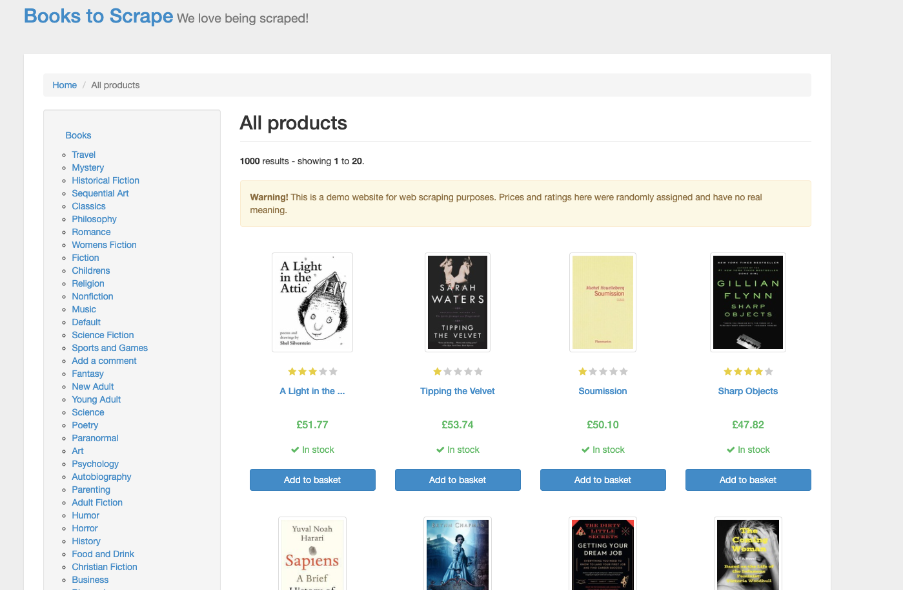
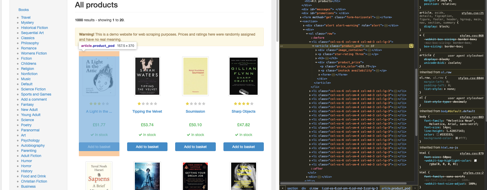
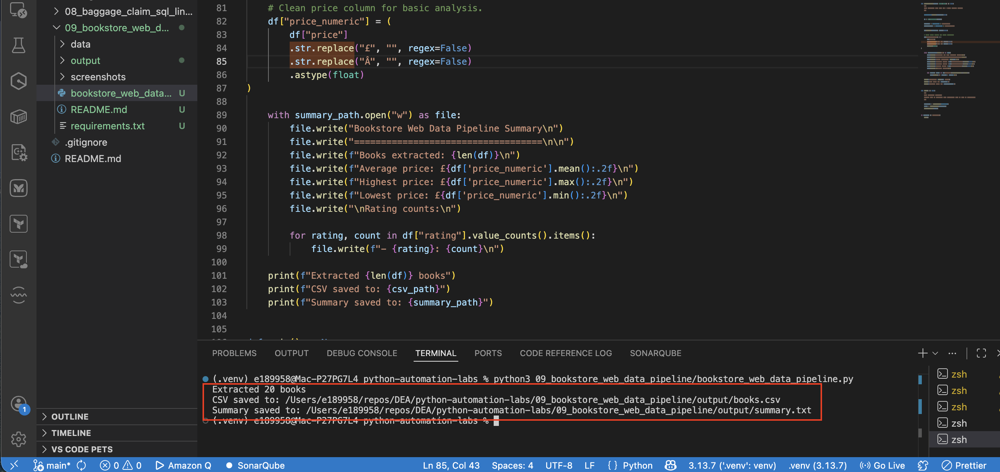
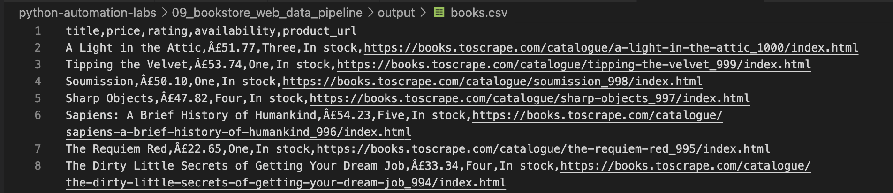
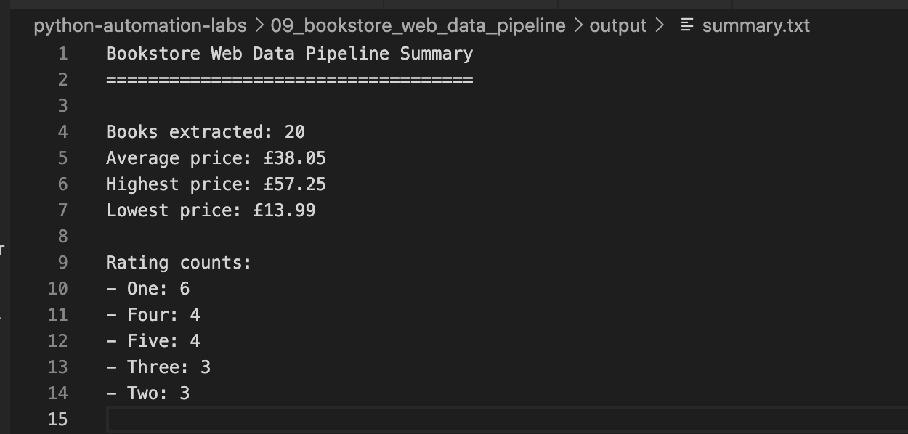
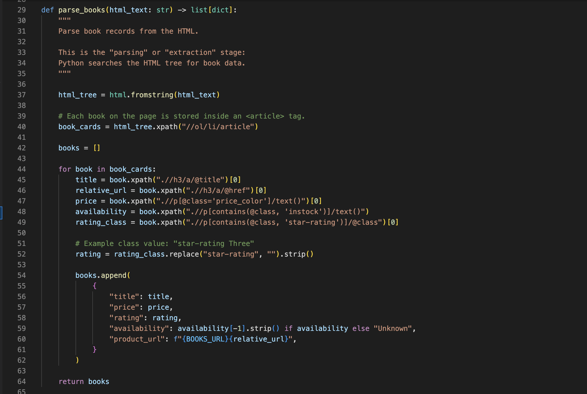

# Bookstore Web Data Pipeline

## Overview

This mini-project demonstrates how Python can extract structured data from a webpage.

The script visits the practice website Books to Scrape, downloads the HTML, parses book details using XPath, and saves the extracted data into CSV and summary report outputs.

This project follows the core web scraping workflow:

`HTTP request → HTML response → parse HTML → extract fields → save structured data`

---

## Why This Matters

Web scraping is useful when data exists on a webpage but is not available as a clean CSV, database table, or API.

In data engineering and analytics workflows, scraping can be used to:

- Collect public web data
- Extract tables or listings
- Convert unstructured HTML into structured rows
- Create CSV or JSON outputs for downstream analysis
- Practice ingestion and parsing concepts

This project uses a safe practice website created specifically for scraping demos.

---

## What This Project Covers

- HTTP request / response cycle
- `requests`
- `lxml`
- XPath selectors
- HTML parsing
- Extracting page elements
- Saving results to CSV
- Creating a simple summary report
- ETL-style workflow

---

## Source Website

---

## How It Works

1. Send an HTTP GET request to the website
2. Receive the HTML response
3. Convert the HTML text into a searchable HTML tree
4. Use XPath to find each book card
5. Extract title, price, rating, availability, and product URL
6. Store extracted records in a pandas DataFrame
7. Save the results to `books.csv`
8. Save a simple summary report to `summary.txt`

---

## Inspecting the HTML

The browser inspect tool helps identify the HTML tags and attributes that contain the data.

For example, each book is stored in an `article` tag, and the title is stored in an `a` tag inside an `h3` tag.

---

## Key XPath Examples

### Find all book cards

`//ol/li/article`

### Extract book title from each card

`.//h3/a/@title`

### Extract book URL

`.//h3/a/@href`

### Extract book price

`.//p[@class='price_color']/text()`

---

## How to Run

Install dependencies:

`python3 -m pip install -r 09_bookstore_web_data_pipeline/requirements.txt`

Run the script:

`python3 09_bookstore_web_data_pipeline/bookstore_web_data_pipeline.py`

---

## Example Script Execution

---

## CSV Output

---

## Summary Output

---

## Code Example

---

## Key Concepts

### HTTP Request

An HTTP request is how a browser or script asks a website for data.

In this project:

`requests.get(url)`

asks the website for the HTML page.

---

### HTTP Response

The HTTP response is what the server sends back.

In this project, the response body is HTML.

---

### HTML

HTML is the structure of a webpage.

The scraper reads HTML to find specific tags, attributes, and text values.

---

### DOM

The DOM is the tree-like structure of a webpage.

The `lxml` library turns raw HTML text into a searchable tree.

---

### XPath

XPath is a query language for selecting parts of an HTML or XML document.

Example:

`.//h3/a/@title`

means:

Find an `a` tag inside an `h3` tag and return the `title` attribute.

---

### Crawling / Fetching

Crawling or fetching means retrieving the webpage content.

---

### Parsing / Extracting

Parsing means reading the HTML structure and extracting the useful pieces of data.

---

## Web Scraping Hygiene

This project uses a practice website designed for scraping.

Good scraping habits include:

- Use public or practice websites when learning
- Check site rules and `robots.txt`
- Avoid sending too many requests
- Do not scrape private, sensitive, or restricted data
- Prefer APIs when available
- Add delays for larger scraping jobs

---

## Key Takeaway

Web scraping converts webpage content into structured data.

In this project:

- Python requests the webpage
- HTML is parsed with `lxml`
- XPath extracts book details
- Results are saved as CSV
- A summary report is generated

This mirrors a small data ingestion pipeline.

---

## Real-World Data Engineering Connection

This project simulates a simple web data ingestion pipeline.

In real-world data engineering, similar workflows may be used when:

- Ingesting public reference data
- Extracting data from HTML tables
- Monitoring public listings
- Creating structured datasets from semi-structured web pages
- Feeding scraped data into downstream analytics workflows

This project connects web scraping to the broader data pipeline pattern of extracting, transforming, and loading data.
